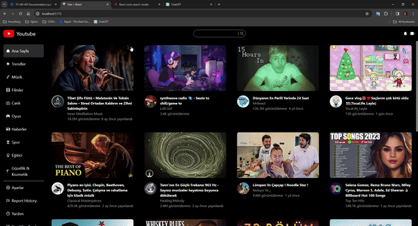

# youtube-clone

I created a youtube clone with React. I implemented the dynamics of the project using various libraries. 
Using the information from the API, I added the video information, relevant videos and video comments to my project.

# Libraries
- react-router-dom
- react-icons
- axios
- millify
- moment
- react-player
- tailwind

# KAYNAK
- API:https://rapidapi.com/ytjar/api/yt-api

